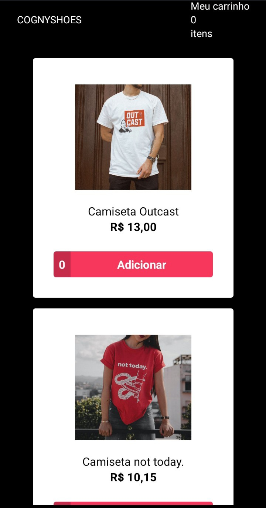
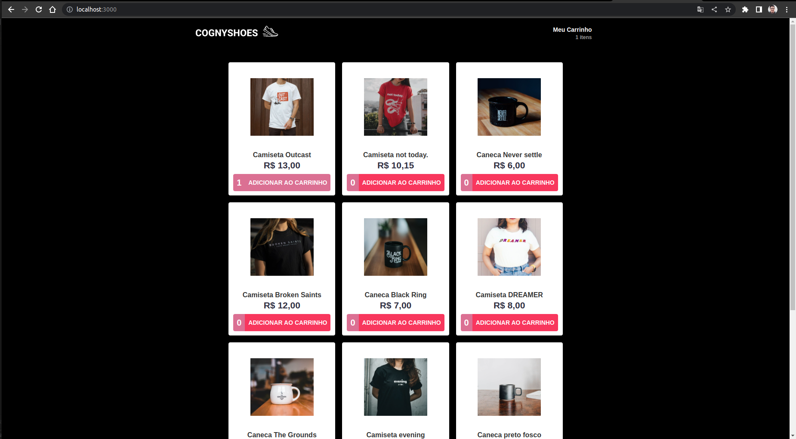

<h2 align="center">
  Cogny Web/Mobile Teste
</h2>

<p align="center">
  
</p>

## Tecnologias

- [React](https://reactjs.org)
- [React Native](https://facebook.github.io/react-native/)
- Firebase

## Descrição

Cognyshoes é um e-commerce proposto pela Cogny para avaliar as habilidades de possíveis novos colaboradoes.

A proposta consiste em desenvolver uma simples aplicação, com versões web e mobile, para listagem de produtos e criação de pedidos, integrando com o Firebase.

Deve-se criar um projeto no Firebase e integrá-lo aos projetos web e mobile disponibilizados nesse teste, fazendo com que compartilhem os mesmos dados para desenvolver os seguintes pontos:

1. No Firebase, use o Firestore Database para criar suas coleções. 
2. Crie uma coleção para armazenar os produtos, cadastrando no mínimo 10 produtos, com Descrição, Preço e Imagem Url.
3. Siga os estilos propostos nesse Template [Figma](https://www.figma.com/community/file/1210687833751035228) e desenvolva as duas telas em ambos os ambientes.
4. A tela de listagem de produtos deve consumir os dados criados anteriomente no Firebase.
5. A tela do carrinho deve conter os produtos selecionados pelo usuário na tela anterior, não deixando o usuário adicionar o mesmo produto mais de uma vez.
6. Ao finalizar o pedido, deve-se apresentar um alerta para o usuário, informando que o pedido foi finalizado e remover os produtos selecionados, liberando o carrinho para novas compras.

<b>Desafio: </b> Criar uma ou mais coleções no Firebase e armazenar os produtos selecionados pelo usuário presentes no carrinho. 

## Entrega

A entrega do código deve ser realizada através do GitHub seguindo as seguintes instruções:

1. Faça fork do projeto.
2. Crie uma branch para alterações na master.
3. Faça o que é pedido no teste.
4. Faça push dessa branch para seu projeto no GitHub
5. Abra um Pull Request para o proprietário do projeto.

<i>Observação 01.: Não subir as credenciais do Firebase para o GitHub.</i>
<br/>
<i>Observação 02.: O candidato deve apresentar aos recrutadores o que foi desenvolvido.</i>

## Links úteis

- [Guias Firebase](https://firebase.google.com/docs/guides?authuser=2&%3Bhl=pt&hl=pt#acesse-o-firebase-na-sua-plataforma)


#### DESENVOLVIDO:

## 💻 Sobre o projeto
​
Esse desafio foi proposto pela empresa COGNYHUB, em que foram requisitadas habilidades necessáiras para desenvolver um projeto **Front-End**. O resultado final é a aplicação em React de uma plataforma para **e-commerce**. 
​
Os usuários terão acesso Desktop e Mobile, onde poderão:
​
- Listar produtos
- Adicionar ao carrinho
- Finalizar compra

​
## 🎨 Layout

### Mobile


### Desktop



🛠 Tecnologias

As seguintes ferramentas foram usadas na construção do projeto:
* React Js
* Context API
* React Router
* Firebase
* Docker
​
## 🚀 Como executar o projeto
​
### Pré-requisitos
Antes de começar, você vai precisar ter o [Git](https://git-scm.com) instalado em sua máquina.
Além disto é bom ter um editor para trabalhar com o código como [VSCode](https://code.visualstudio.com/).
​
### 🧭 Rodando a aplicação WEB

### Rodando localmente

```javascript
  git clone https://github.com/joao966/cogny-front-end-test.git
```

1. Entre no diretório criado após a clonagem do repositório.
```javascript
  cd cogny-front-end-test
```

2. Entre no diretório mobile
```javascript
  cd web
```

3. Instale as dependencias.
```javascript
  npm i
```

4. Realize o start da Aplicacao.
```javascript
  npm start | npx expo start
```


### Rodando com Docker

1. Entre no diretório criado após a clonagem do repositório.
```javascript
  cd cogny-front-end-test
```
2. Entre no diretório criado após a clonagem do repositório.
```javascript
  cd web
```

3. Instale as dependencias.
```javascript
  npm run docker
```


### 🧭 Rodando a aplicação MOBILE

### Rodando localmente

```javascript
  git clone https://github.com/joao966/cogny-front-end-test.git
```

1. Entre no diretório criado após a clonagem do repositório.
```javascript
  cd cogny-front-end-test
```

2. Entre no diretório mobile
```javascript
  cd mobile
```

3. Instale as dependencias.
```javascript
  npm i
```

4. Realize o start da Aplicacao.
```javascript
  npm start | npx expo start
```


### Rodando com Docker

1. Entre no diretório criado após a clonagem do repositório.
```javascript
  cd cogny-front-end-test
```

2. Entre no diretório criado após a clonagem do repositório.
```javascript
  cd mobile
```

3. Instale as dependencias.
```javascript
  npm run docker
```


OBS: certifique de ter o docker e o docker-compose intalado em sua maquina.